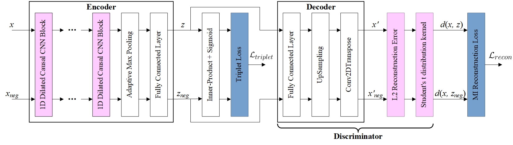

# EUDTR

## Introduction
Multivariate time series have been a challenging data type for machine learning algorithms due to their inherent complexity, e.g., highly variable length, dynamic nature, a large number of variables, sparse labels, etc. To address these challenges, an effective and efficient unsupervised representation learning is necessary. Existing representation learning research for multivariate time series suffers from the following weaknesses: 

1) the learned representation is sensitive to both the input noise and the hyperparameter embedding dimension, 

2) the learned representation is not sufficiently discriminative for downstream multivariate time series applications, and 

3) the process of representation learning is inefficient. 

In this paper, we address all these issues and propose a more effective and efficient unsupervised representation learning method for clustering of multivariate time series, called <u>**EUDTR**</u> (<u>**E**</u>nhanced <u>**U**</u>nsupervised <u>**D**</u>eep <u>**T**</u>emporal <u>**R**</u>epresentation learning). Our contributions can be summarized as follows:

1. For the first time, we propose to maximize the mutual information between an input and its output of a deep neural network encoder to deal with unsupervised representation learning for multivariate time series clustering, and to tackle the above weakness 1.

2. We propose to jointly optimize both the mutual information and the negative sample learning with a proposed Triplet loss to address the above weakness 2).

3. To our knowledge, we are the first to introduce variable stacked dilated causal convolutions into the encoder for adaptive processing of diverse lengths of multivariate time series, and to integrate a proposed discriminator into the decoder, an original lightweight discriminator, to deal with the above weakness 3).

4. Extensive experiments conducted on benchmark datasets show that our proposed unsupervised deep representation learning method, namely EUDTR, for multivariate time series clustering, achieves a new SOTA results. 

Our EUDTR consists of two main components, the Encoder and the Discriminator embedded with its Decoder. The pipeline of the representation learning and its neural network model of the EUDTR are shown in Fig. 1.


<center>Figure 1. The pipeline of the representation learning and its neural network model of the proposed EUDTR.</center>


## Install & Running
###  Environment
This implementation was written for Python 3.x.

### Dependencies
```
torch==1.6.0
scikit-learn==0.22.2.post1
numpy==1.19.1
tslearn==0.3.1
scipy==1.5.2
```

### Running
To train the **EUDTR** model, run the main script `main.py` with command-line arguments. Available arguments are explained with:
```
python main.py --help
```

## Datasets
### Multivariate time series datasets
We chose eight multivariate time series datasets from The UEA archive, which are **ArticularyWordRecognition**, **BasicMotions**, **Cricket**, **ERing**, **Heartbeat**, **PenDigits**, **UWaveGestureLibrary**, and **UWaveGestureLibrary**, respectively. For more details on the data set, please refer to [this paper](https://arxiv.org/abs/1811.00075).You can download the whole multivariate time series data set through [this link](http://www.timeseriesclassification.com/).

The basic information of data set as follows.

| Hyper-parameters | ArtiWordRecog | BasicMotions | Cricket | ERing | Heartbeat | PenDigits | UWave | MotorImagery |
| :--------------: | :-----------: | :----------: | :-----: | :---: | :-------: | :-------: | :---: | :----------: |
|    train_size    |      275      |      80      |   108   |  270  |    204    |   7494    |  120  |     278      |
|    timesteps     |      144      |     100      |  1197   |  65   |    405    |     8     |  315  |     3000     |
|    input_dim     |       9       |      6       |    6    |   4   |    61     |     2     |   3   |      64      |
|  cluster_number  |      25       |      4       |   12    |   6   |     2     |    10     |   8   |      2       |

## Files

### EUDTR folder

- `main.py` file: the entry file of the whole algorithm program
- `representation_train.py` file:training process of the whole network
- `network.py` file:the detailed structure of autoencoder network
- `metrics.py` file:evaluation criteria of experimental results
- `reconstruction_loss.py` file:implement the reconstruction loss for getting maximum mutual information between raw data and representation
- `triplet_loss.py` file:implements the triplet loss .
- `utils.py` file:the details preprocessing of train data and getting negative samples for each of raw data

## Comparison algorithm

We compare our algorithm with some multivariate time series representation and  clustering algorithms using deep learning. The details of these algorithms are as follows

- **DeTSEC algorithm**

  paper: [https://link.springer.com/chapter/10.1007%2F978-3-030-47426-3_25](https://link.springer.com/chapter/10.1007%2F978-3-030-47426-3_25)

  code:[https://gitlab.irstea.fr/dino.ienco/detsec](https://gitlab.irstea.fr/dino.ienco/detsec)


- **USRL algorithm**

  paper:[https://papers.nips.cc/paper/2019/file/53c6de78244e9f528eb3e1cda69699bb-Paper.pdf](https://papers.nips.cc/paper/2019/file/53c6de78244e9f528eb3e1cda69699bb-Paper.pdf)

  code:[https://github.com/White-Link/UnsupervisedScalableRepresentationLearningTimeSeries](https://github.com/White-Link/UnsupervisedScalableRepresentationLearningTimeSeries)

- **DTC algorithm**

  paper:[https://arxiv.org/pdf/1802.01059.pdf](https://arxiv.org/pdf/1802.01059.pdf)

  code:[https://github.com/FlorentF9/DeepTemporalClustering](https://github.com/FlorentF9/DeepTemporalClustering)


- **DTCR algorithm**

  paper:[https://proceedings.neurips.cc/paper/2019/file/1359aa933b48b754a2f54adb688bfa77-Paper.pdf](https://proceedings.neurips.cc/paper/2019/file/1359aa933b48b754a2f54adb688bfa77-Paper.pdf)

  code:[https://github.com/qianlima-lab/DTCR](https://github.com/qianlima-lab/DTCR)